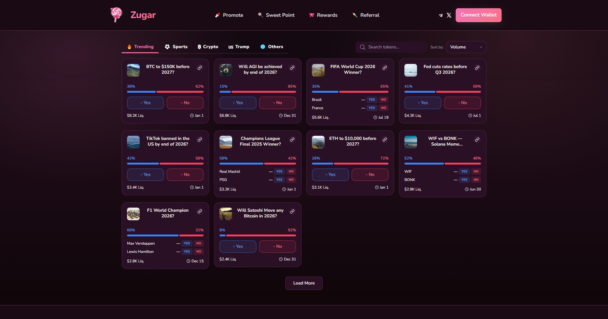
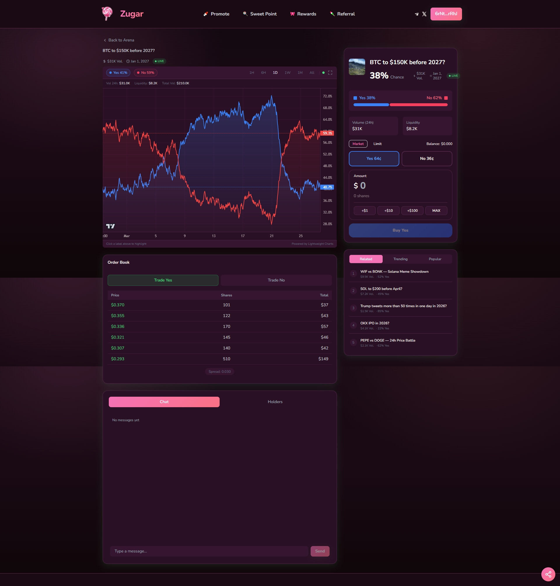
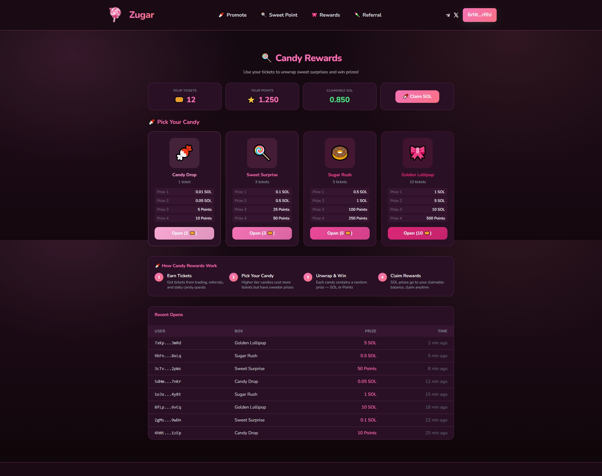
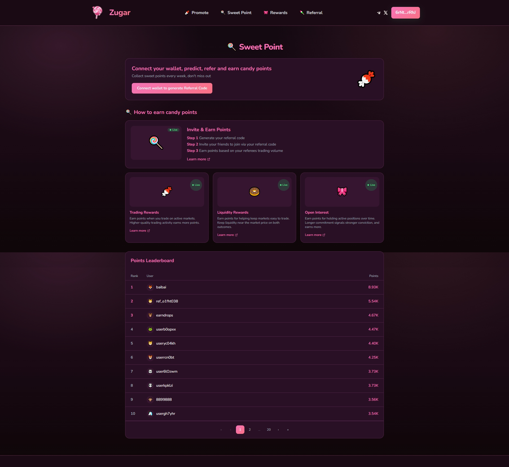
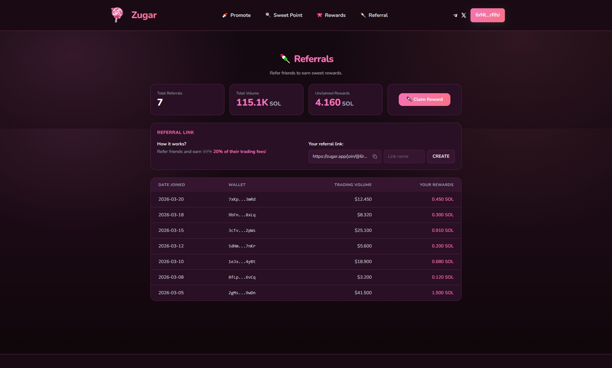
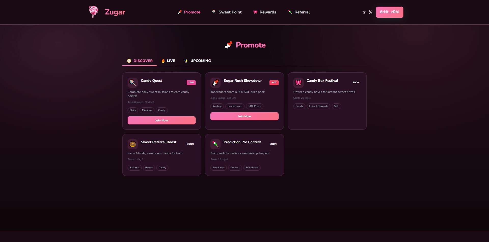

# Zugar - Solana Token Trading Platform

> Decentralized token trading platform built on **Solana** with real-time pricing, wallet integration, and prediction markets.

## Demo

### Home Page


### Trading


### Candy Reward


### Sweet Points


### Referrals


### Promote


## Tech Stack

| Layer | Tech |
|-------|------|
| Framework | Next.js 14, TypeScript |
| Blockchain | Solana Web3.js, Wallet Adapter (Phantom, Solflare) |
| Charts | Lightweight Charts (TradingView engine) |
| Styling | TailwindCSS + CSS Variables |
| Real-time | WebSocket (auto-reconnect, exponential backoff) |
| HTTP | Axios with retry, proxy, idempotency |

## Getting Started

```bash
# Prerequisites:
Node.js >= 20, Phantom/Solflare wallet
Install backend first : https://github.com/astroboy26032026-sketch/chain-prediction-market-backend

npm install
npm run dev        # http://localhost:3000
```

### Environment (.env.local)

```env
NEXT_PUBLIC_SOLANA_RPC_URL=https://api.devnet.solana.com
NEXT_PUBLIC_API_BASE_URL=https://dev.zugar.app
NEXT_PUBLIC_WS_BASE_URL=wss://dev.zugar.app
NEXT_PUBLIC_SITE_URL=http://localhost:3000
NEXT_PUBLIC_DOMAIN=zugar.app
```

## Project Structure

```
src/
├── components/          # UI components (auth, charts, layout, token, notifications)
├── hooks/               # useSwapTrading, useTokenDetail, useTokenPriceStream
├── pages/               # Next.js pages + API routes
├── utils/               # API client, auth, security, helpers
├── interface/           # TypeScript types
├── data/                # Mock markets & events data
├── constants/           # UI text constants
└── styles/              # TailwindCSS + CSS variables
```

## Security

- API proxy with rate limiting (120 req/min), CSRF protection, path whitelist
- CSP headers, HSTS, X-Frame-Options: DENY
- Idempotency keys for trade deduplication
- Input sanitization (XSS), Solana address validation
- Zero private key handling (all signing in wallet extension)

## Documentation

See [TECHNICAL.md](TECHNICAL.md) for detailed technical documentation (architecture, data flows, interview prep).
